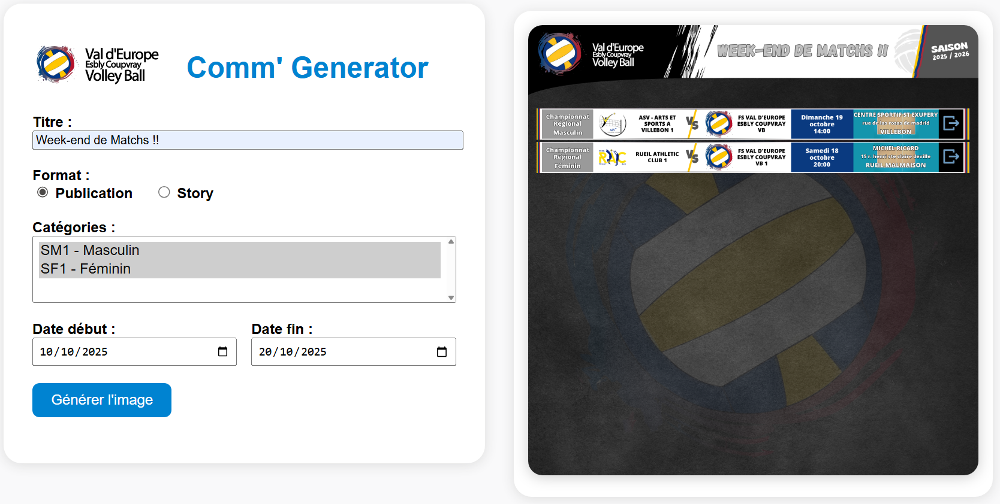

## FFVB-Parser - Comm'Generator

FFVB-Parser is a tool for parsing scores and data provided by the FFVB website (https://www.ffvb.org / https://www.ffvbbeach.org/ffvbapp/).
The aim is to be able to dynamically generate regular graphical tables of the scores of the selected club.



---
## Features

- 📱 **Communication** - Generate PNG Image
- 📅 **Planning** - Lists your teams' upcoming matches
- 🏐 **Results** - View all past results
- 🗄️ **Data live** - Based directly on data from the FFVB
- 🚀 **Functions** - Custom title, publication, story...

---

## Quick Start with Docker

### Prerequisites
- Docker and Docker Compose installed

### Build Image

  * For developpement (live debug mode)
```
docker build -t veec-comm-generator:dev -f Dockerfile.dev .
```

  * For production
```
docker build -t veec-comm-generator:v0.0.1 -f Dockerfile.prod .
```

### Using Pre-built Image

#### Docker
```
docker run -it --rm -v $PWD:/app -p 8000:8000 veec-comm-generator:dev
```

#### Docker compose
1. Create a `docker-compose.yml` file:

```yaml
services:
  veec-comm-generator:
    image: veec-comm-generator:v0.0.1
    container_name: veec-comm-generator
    restart: unless-stopped
    ports:
      - "8000:8000"
```

2. Start the container:
```bash
docker-compose up -d
```

#### Run

Open http://localhost:8000 in your browser

